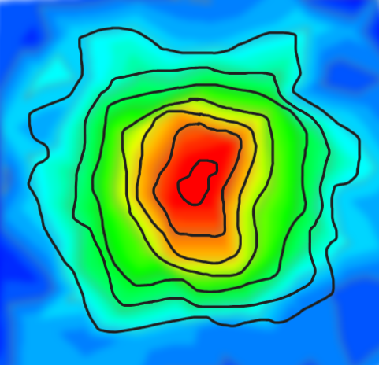
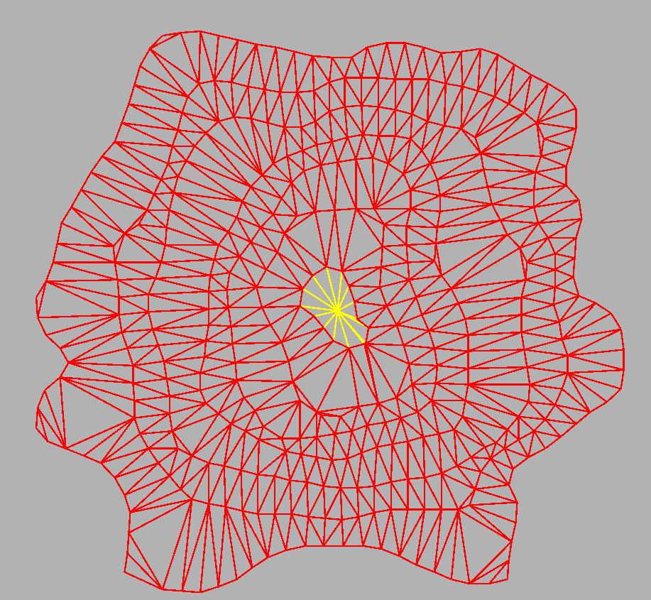
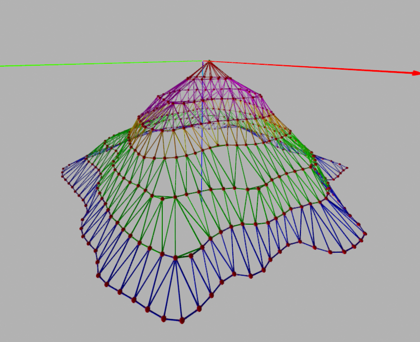

### Input

Map image containing closed curves (contours).

---

## Part A

1. **Detection of the image curves and their polygonal representation**

2. **Triangulation of the map in two dimensions and presentation of the result as a `terrain` in three dimensions**

   Repeat using **Delaunay triangulation**, with the following constraints:

   - a. The minimum angle in 3D must be > α degrees
   - b. The area of each triangle must be < δ
 

---

## Part B

3. **User-defined parameters**

   The user must be able to define:

   - The average height of each closed curve
   - The method of height variation for regions within the curve

4. **Coloring of the terrains based on altitude**

5. **Calculation and visualization of the `dual graph` for each case**

6. **Calculation and visualization of the minimum distance between two random points on the map using the dual graph**

7. **Repeat step 6 with the constraint that transitions must not have a slope > 10%**

   

---
